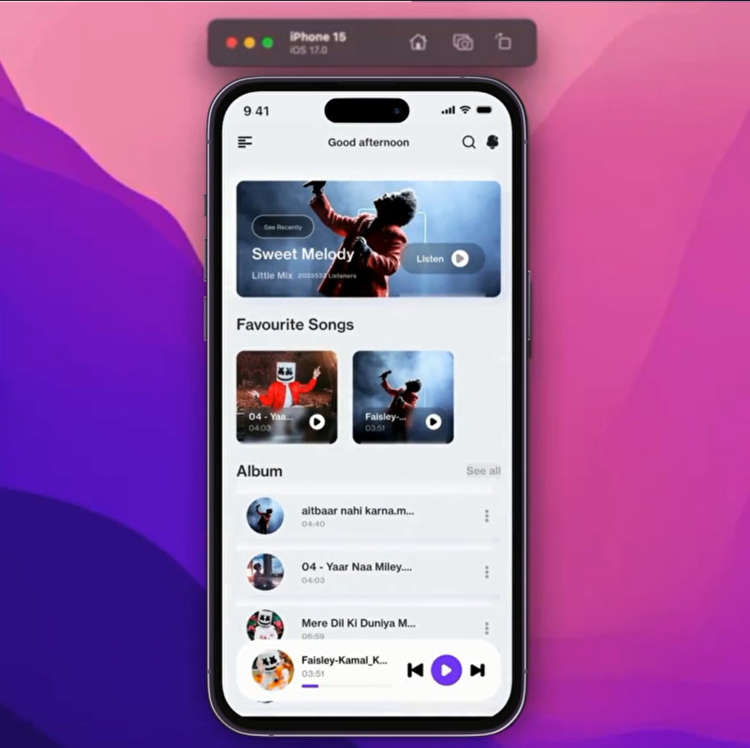
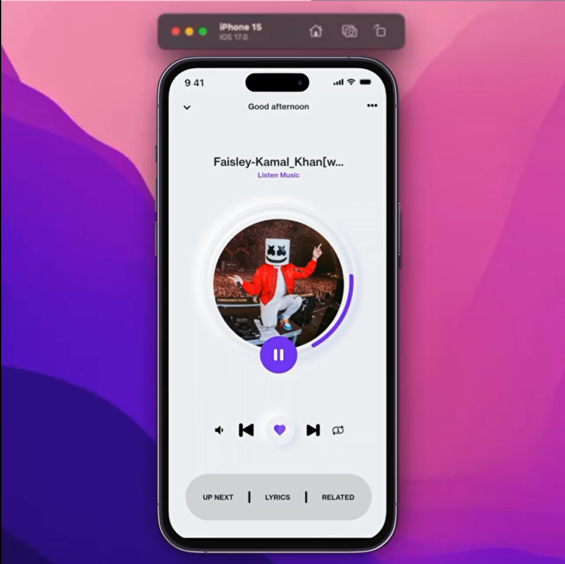

<p align="center">
  
</p>

<h1 align="center">🎵 BeatFlow - Flutter Music Player</h1>

<p align="center">
  Aplicación moderna de streaming y reproducción musical desarrollada en <b>Flutter</b> utilizando <b>BLoC Architecture</b> para un manejo de estado limpio, escalable y reactivo.
</p>

<p align="center">
  
  
  
  
  
</p>

---

# ✨ Características

🎧 Reproducción de música local  
🎵 Exploración automática de canciones del dispositivo  
💿 Reproductor elegante y minimalista  
🖤 Diseño moderno estilo neumorphism  
⚡ Arquitectura reactiva con BLoC  
📂 Organización inteligente de canciones  
❤️ Sistema de favoritos  
📱 UI responsive y fluida  
🔊 Controles avanzados de reproducción  
🌙 Experiencia visual premium  

---

# 📸 Capturas de Pantalla

<p align="center">
  
  
</p>

---

# 🛠️ Tecnologías Utilizadas

### 📱 Mobile
<p>
  
</p>

### ⚙️ State Management
<p>
  
</p>

### 💾 Base de Datos & Storage
<p>
  
</p>

### 🔊 Audio Engine
- Just Audio
- On Audio Query

### 🎨 UI & Diseño
- Neumorphic Design
- Google Fonts
- SVG Support
- Shimmer Effects

---

# 📂 Estructura del Proyecto

```bash
lib/
├── bloc/               # Manejo de estados BLoC
├── screens/            # Pantallas principales
├── widgets/            # Widgets reutilizables
├── models/             # Modelos de datos
├── services/           # Servicios y lógica
├── database/           # SQLite y almacenamiento
├── utils/              # Utilidades
└── main.dart
```

---

# 🚀 Instalación

1️⃣ Clonar repositorio
```
git clone https://github.com/isairey/BeatFlow.git
cd BeatFlow
```
2️⃣ Instalar dependencias
```
flutter pub get
```
3️⃣ Ejecutar aplicación
```
flutter run
```
---

# 📦 Dependencias Principales
```
bloc:
flutter_bloc:
equatable:
shared_preferences:
google_fonts:
flutter_svg:
sqflite:
path_provider:
permission_handler:
just_audio:
on_audio_query:
shimmer_effect:
```
---

# 🎯 Roadmap

- Soporte para playlists
- Streaming online
- Sincronización en la nube
- Letras sincronizadas
- Equalizer avanzado
- Modo offline
- Login con Google
- UI estilo Spotify

 ---
 
# ⚡ Rendimiento

- ✔️ Arquitectura escalable
- ✔️ Manejo eficiente del estado
- ✔️ Reproducción optimizada
- ✔️ Bajo consumo de memoria
- ✔️ Navegación fluida

---

# 🤝 Contribuciones

Si deseas mejorar el proyecto:

-Haz un Fork
-Crea una rama
-git checkout -b feature/nueva-funcion
-Realiza tus cambios
-Haz commit
-git commit -m "Nueva funcionalidad"
-Sube los cambios
-git push origin feature/nueva-funcion
-Abre un Pull Request 🚀
👨‍💻 Autor
<p align="center">  </p> <h3 align="center">Isai Reyes</h3> <p align="center"> Desarrollador Full Stack • Mobile Developer • UI/UX Enthusiast </p> <p align="center"> <a href="https://github.com/isairey">  </a> </p>


